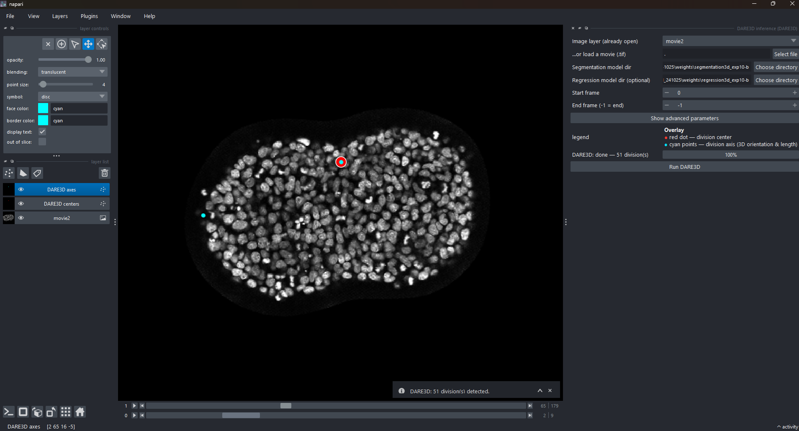

<div align="center">

# DARE3D — Division Axis and Region Estimation in 3D time-lapse images

<a href="https://pytorch.org/get-started/locally/"></a>
<a href="https://pytorchlightning.ai/"></a>
<a href="https://hydra.cc/"></a>
<a href="https://napari.org"></a>

<br>



</div>

---

**DARE3D** detects cell divisions in 3D time-lapse image volumes and estimates each division's
**center**, **orientation**, and **axis length**, in two stages:

1. **Segmentation** — detect the center of each division (the barycenter of the two daughter cells).
2. **Regression** — estimate the division-axis orientation and length.

This repository contains **both** the core deep-learning framework (PyTorch Lightning + Hydra)
**and** the **napari plugin** (`napari_dare3d`) that runs it interactively — installed together
by a single `pip install -e .`.

> **What's new in this version.** The headline addition is the **napari plugin** — interactive 3D
> inference and retraining straight from the napari GUI (DARE3D's core was already PyTorch). Input
> stacks are `(T, Z, Y, X)`; each detected division is returned as a **center** plus a **division
> axis** encoded as a unit **quaternion** (the axis is the normalised imaginary part of the
> quaternion) and an **axis length** in voxels.
>
> **Citation.** If you use DARE3D, please cite the preprint:
> Karpinski *et al.*, *bioRxiv* 2024 — <https://www.biorxiv.org/content/10.1101/2024.02.05.578987v2>
>
> **Authors:** Romain Karpinski, Marc Karnat, Alice Gros, Qazi Saaheelur Rahaman, Jules Vanaret,
> Mehdi Saadaoui, Sham Tlili, and Jean-François Rupprecht.

## Project structure

```
DARE3d/
├── dare3d/                     # core framework (PyTorch Lightning + Hydra)
│   ├── data/                   # datamodule + dataset components (seg / regression / tap / segres)
│   ├── models/                 # LightningModules + nets (multiscale U-Net, SwinUNETR)
│   ├── losses/                 # segmentation / angle / quaternion losses
│   ├── metrics/                # inference + object-level matching (centers, axes, lengths)
│   ├── loggers/                # training-time image-panel loggers (seg / regression)
│   ├── tools/                  # CV-split + sparse-weight generators
│   ├── utils/                  # logging, instantiation, helpers
│   ├── train.py                # training entry point (Hydra)
│   ├── eval.py                 # evaluation entry point
│   ├── predict.py              # inference entry point
│   └── train_eval.py           # seg → regression → eval orchestrator
├── napari_dare3d/              # napari plugin (in-process inference + training)
│   ├── _api.py                 # napari-free inference API (reuses dare3d.metrics)
│   ├── _widget.py              # inference widget
│   ├── _train_widget.py        # retraining + fine-tuning widget (beta)
│   ├── _train.py               # builds + streams the Hydra training subprocess
│   ├── _data.py, _io.py        # TIFF (T,Z,Y,X) loading + coordinate mapping
│   └── napari.yaml             # npe2 plugin manifest
├── configs/                    # Hydra config tree (experiment/ model/ data/ trainer/ logger/ …)
├── notebooks/                  # Run_dare3d_Prediction / Run_dare3d_Retraining / Run_dare3d_Finetune + data viz
├── scripts/                    # dataset/experiment generators
├── tests/                      # pytest suite — unit + integration, plus geometry &
│                               #   training-command self-checks (no GPU/models/napari)
├── requirements.txt, setup.py, pyproject.toml   # dependencies + packaging
└── README.md
```

Per-package internals are documented in [`dare3d/README.md`](dare3d/README.md) (core framework) and
[`napari_dare3d/README.md`](napari_dare3d/README.md) (plugin).

## Installation

**Prerequisites:** Python 3.10 and Conda (recommended). An NVIDIA GPU with **CUDA 11.8+** is
**required for training** and strongly recommended for inference; **inference also runs CPU-only**
(both segmentation and regression), just slower — fine for small movies.

```bash
git clone https://github.com/qazi05/DARE3d
cd DARE3d

# 1) conda environment
conda create -n dare3d-v2 python=3.10 -y
conda activate dare3d-v2

# 2) PyTorch first — install a CUDA build matching your GPU. Training needs torch >= 2.5
#    (cuDNN >= 9); older cuDNN 8.x segfaults on 3D convolutions (see "Training & retraining").
#    Default — CUDA 12.8 wheels (torch >= 2.7; includes RTX 50-series / Blackwell sm_120 kernels):
python -m pip install torch torchvision torchaudio --index-url https://download.pytorch.org/whl/cu128
#    Other/older GPUs, a different CUDA, or CPU-only: use the official selector at
#    https://pytorch.org/get-started/locally/  (CPU-only torch runs the full inference
#    pipeline — segmentation + regression — but training needs a CUDA GPU).

# 3) the rest of the dependencies
pip install -r requirements.txt

# 4) napari + its Qt backend (install explicitly so the GUI backend is present)
pip install "napari[all]"

# 5) the project itself (core + napari plugin)
pip install -e .
```

The editable install registers the napari plugin via its `napari.manifest` entry point, so
**napari lists "DARE3D" under Plugins** with no extra step. (CPU-only PyTorch runs the full
inference pipeline — segmentation + regression; **only training requires a CUDA GPU**.)

> **Import errors after a layout change?** Re-run `pip install -e .` to refresh the editable
> install. For full Hydra tracebacks, set `HYDRA_FULL_ERROR=1` (PowerShell: `$env:HYDRA_FULL_ERROR=1`).

## Models & data

The training/inference dataset (pretrained weights + demo movies) is published on **Zenodo**
([record 19113351](https://zenodo.org/records/19113351): `DARE3d_data_190326.zip`). Unzip it at
the repository root so models resolve as
`DARE3d_data_190326/<case>/weights/{segmentation3d_*,regression3d_*}` (the bundle ships the
**Gastruloid** and **Neural tube** cases). Or click **Download DARE3D data (Zenodo)** in the plugin
(Plugins → DARE3D) to fetch and unzip it automatically into the folder you launch napari from.

A model directory is any folder containing `.hydra/config.yaml` + `checkpoints/last.ckpt`.

## Data format

- **Input movies** are TIFF stacks in disk/napari order `(T, Z, Y, X)` (a bare `(Z, Y, X)` volume is
  treated as a single time frame). Internally DARE3D swaps to `(T, X, Y, Z)`; the napari plugin hides
  this and maps results back to `(t, z, y, x)` for you. `.tif` and `.tiff` are both accepted,
  case-insensitively.
- **Training data** lives under `data/3d/<dataset>/{train,val}/{im,label}/*.tif`, one 4-D movie per
  file. **Labels** encode the daughter-cell pair: first daughter → **odd** instance ids, second →
  **even** ids. An optional `train/weights/` folder supplies per-voxel sparse weighting.
- **Voxel scale** (anisotropy) is read per movie from the backward-compatible
  `data/3D/scales.json` table in x,y,z µm/voxel. The TIFF filename stem is the lookup key.
  A matching table entry takes precedence; a missing file or entry uses the experiment's
  `default_scale` (for example `0.621, 0.621, 2`).

## Configuration (Hydra)

The CLI (`train.py`, `eval.py`, `predict.py`) is driven by a composable **Hydra** config tree under
[`configs/`](configs) — `experiment/`, `model/` (`net/`, `criterion/`, `optimizer/`, `scheduler/`),
`data/`, `trainer/`, `logger/`, `paths/`, … Any field can be overridden on the command line without
editing files:

```bash
# choose an experiment preset, then override individual fields
python dare3d/train.py experiment=segmentation data.batch_size=8 trainer.max_epochs=100
python dare3d/train.py experiment=regression   model.optimizer.lr=0.001
```

- Prefix a key with `+` to **add** one that isn't in the chosen config (e.g. `+segmentation.model_dir=…`).
- Every run writes its **resolved config** to `<output>/.hydra/config.yaml`; that is exactly what a
  *model directory* carries (`.hydra/config.yaml` + `checkpoints/`), so inference can reload the
  training settings.
- Hydra **multirun** (`-m`) sweeps parameters, e.g. `python dare3d/train.py -m data.batch_size=4,8`.

## Inference

Inference can be run **three ways** — pick whichever fits your workflow:

An installed checkout also exposes the equivalent `predict_command` console entry
point.

**1. Terminal (CLI).**

```bash
python dare3d/predict.py \
  segmentation.model_dir=<seg_model_dir> \
  regression.model_dir=<reg_model_dir> \
  inference_dir=<folder_with_one_TZYX_tif> \
  device=gpu
```

Results (probability map, division-axis render, and a `raw_predictions.npz` of centers + rotation
matrices + lengths) are written under the Hydra run directory. Useful overrides:

- **Voxel scale:** `default_scale=[0.621,0.621,2]` (x,y,z µm) or `scale_file=data/3D/scales.json`.
- **Detection tuning:** `segmentation.threshold=0.5`, `segmentation.min_weighted_prob=0.1`,
  `segmentation.inference_overlap=0.25`, `segmentation.inference_batch_size=4`.
- **Device:** `device=gpu` (recommended) or `device=cpu` — both run the full pipeline
  (segmentation + regression); CPU is slower.
- Omit `regression.model_dir` to get **centers only** (no axes).

Regression prediction, evaluation, and the napari/API path default to
`training_consistent`: the input movie is resampled exactly as it is for regression
training before the checkpoint crop is extracted. `legacy_raw` remains available only
as an explicit historical replay mode, for example
`regression.preprocessing_mode=legacy_raw`. New outputs name raw-grid,
regression-grid, and physical geometry explicitly while retaining the historical
`center`, `rotation`, and `length` fields for existing consumers.

Saved model configs may contain scale-file paths from the training workstation. The
prediction CLI ignores such a saved path and uses the saved `default_scale` unless the
current invocation supplies `scale_file=...`. Set
`regression.require_scale_file=true` to fail instead of falling back when a movie has
no scale entry. Evaluation exposes the corresponding
`regression.scale_file_override`, `default_scale_override`, and
`target_scale_override` settings. The headless napari API accepts
`regression_preprocessing`, `regression_require_scale_file`, and `movie_name`; the
widget uses the production default, passes the selected layer name for table lookup, and
pre-fills the canonical scale table when it is available.

**2. Notebook.** Open `notebooks/Run_dare3d_Prediction.ipynb` — it sets the model/data paths,
validates them, runs segmentation + regression, and visualises the result.

**3. napari plugin.** Launch `napari`, load a 3D/4D stack `(T, Z, Y, X)` or `(Z, Y, X)`, then
**Plugins → DARE3D → DARE3D inference**. Set the segmentation / regression model-dir fields and
**Run** — it overlays the detected division **centers** and **axes** as napari Points layers.
Uncheck *Analyse whole movie* to process only a `[t_start, t_end]` window, expand **Show advanced
parameters** for the fine-tuning knobs, and use **Stop** to abort a long run. Both segmentation
and regression use the per-movie JSON entry when the selected layer name matches. Otherwise a
manual `default_scale`, a non-unit calibrated Image-layer scale, or finally the saved model
default is used. Result layers inherit the Image layer's Napari scale, so anisotropic overlays
remain registered. The built-in TIFF loader does not parse TIFF/CZI physical metadata; unknown
movies therefore still require a calibrated layer or an explicit scale. Both stages run on CPU
or GPU; pick GPU for speed on large movies.

## Postprocessing

DARE3D is **single-model** — there is no ensemble or consensus step. Division **centers** are
extracted from the segmentation head:

1. The 3D U-Net produces a per-voxel division-probability heatmap.
2. The heatmap is thresholded (`threshold`, default `0.5`) into a binary mask.
3. Connected components are labelled and reduced to their centroids.
4. Each candidate is filtered by **size × probability** (`min_weighted_prob`, default `0.1`) to drop
   weak/small blobs.

If a **regression** model is supplied, each surviving center is cropped and passed through the
regression CNN, which outputs the **division-axis orientation** (a unit quaternion; the axis is its
normalised imaginary part) and the **axis length** in voxels. The plugin draws centers (red) and
axes (cyan) as Points layers.

| Parameter | Default | Effect |
|---|---|---|
| `overlap` | `0.25` | Sliding-window overlap for 3D segmentation (higher = more accurate, slower). |
| `threshold` | `0.5` | Probability cut turning the heatmap into candidate centers. |
| `min_weighted_prob` | `0.1` | Minimum size × probability to keep a center. |
| `batch_size` | `4` | 3D patches inferred at once (lower on GPU OOM). |

## Training & retraining

> **Supported training stack: torch >= 2.5 (cuDNN >= 9).** Older cuDNN (8.x, e.g. torch 2.2)
> intermittently **segfaults** during 3D-convolution training (native `0xC0000005`, no Python
> traceback). `dare3d/train.py` guards against this and **fails fast** with install instructions
> (see `check_cudnn_for_3d`). Manual override via the `DARE3D_CUDNN` env var: `DARE3D_CUDNN=0`
> disables cuDNN (stable but slower, to train on an old stack); `DARE3D_CUDNN=1` forces cuDNN on
> (only safe on cuDNN >= 9).

Retraining and fine-tuning can be run from the terminal, the **notebooks**, or the napari widget.
**The notebooks (`Run_dare3d_Retraining.ipynb` / `Run_dare3d_Finetune.ipynb`) are the recommended,
supported workflow; the napari widget is an experimental GUI twin (beta).** **Training requires a
CUDA GPU.** Data layout: `data/3d/<dataset>/{train,val}/{im,label}/*.tif` (movies are
`(T, Z, Y, X)`; labels encode the daughter pair: first daughter → odd ids, second → even ids).

**1. Terminal (CLI).** The `train_eval.py` wrapper runs segmentation → regression → evaluation:

```bash
python dare3d/train_eval.py --set_folder <dataset> --epoch 50
python dare3d/train_eval.py --set_folder <dataset> --epoch 50 --train_regression False   # seg only
python dare3d/train_eval.py --set_folder <dataset> --batch_size 4 --cell_radius 10
python dare3d/train_eval.py --set_folder <dataset> --eval_only True                       # just evaluate

# …or drive the stages directly through Hydra:
python dare3d/train.py experiment=segmentation train_dir=3d/<dataset>/train val_dir=3d/<dataset>/val ...
python dare3d/train.py experiment=regression   train_dir=3d/<dataset>/train val_dir=3d/<dataset>/val ...
```

`train_eval.py` flags:

| Flag | Default | Meaning |
|---|---|---|
| `--set_folder` | *(required)* | Dataset folder name under `data/3d/`. |
| `--epoch` | *(required)* | Max epochs per stage. |
| `--batch_size` | `32` | 3D patches per step (lower on GPU OOM). |
| `--cell_radius` | `8` | Radius (voxels) of the segmentation target spheres. |
| `--seg_crop_size` | `128` | Segmentation training patch size. |
| `--date` | `01-01` | Run id → `runs/<date>/`. |
| `--threshold` | `None` | Eval segmentation threshold (`None` = auto-search). |
| `--train_segmentation` / `--train_regression` | `True` | Toggle each stage. |
| `--eval_only` | `False` | Skip training, only evaluate existing models. |
| `--overwrite` | `True` | Re-run even if the run directory already exists. |

**2. Notebook.** Open `notebooks/Run_dare3d_Retraining.ipynb` — it validates your dataset layout and
drives segmentation → regression → evaluation, streaming the logs inline. To **fine-tune** a
pretrained checkpoint instead of retraining from scratch, use `notebooks/Run_dare3d_Finetune.ipynb`
(the command-line twin of the widget's *Transfer learning — fine-tune* mode: it derives the imposed
architecture from the base, drives the same `experiment=finetune_{segmentation,regression}` flow, and
verifies the run in-process and via subprocess).

Outputs land in `logs/<task>/runs/<date>/` (`.hydra/config.yaml` + `checkpoints/`), ready for the
inference step. Runs are logged to a local **MLflow** SQLite store under `logs/` — browse it with
`mlflow ui --backend-store-uri sqlite:///logs/mlflow.db`. (The napari plugin also exposes a
**DARE3D retraining & fine-tuning** widget — the **beta** GUI twin of the notebooks above, offered
for convenience; prefer the notebooks for supported runs — that wraps these same `train.py` /
`eval.py` steps: a
**Mode** selector switches between *Retrain from scratch* and *Transfer learning — fine-tune*; the
latter reveals per-stage base-checkpoint pickers and an **Advanced** section — `freeze_preset`,
`bn_mode` (frozen/adapt), `ft_lr`, discriminative LR, warmup→cosine, early stopping — driving the
same `experiment=finetune_{segmentation,regression}` flow.)

> **3. ⚠️ Beta — napari GUI.** The retraining / fine-tuning **capability is supported**, but the
> **napari widget** that wraps is **experimental** — its defaults and GUI/API may change. The
> **preferred, supported workflow are the notebooks or CLI options** above (`Run_dare3d_Retraining.ipynb` /
> `Run_dare3d_Finetune.ipynb`), not the widget. 
> 
## Data preparation & helper scripts

Optional helpers for building the `data/3d/<dataset>/{train,val}/{im,label}` layout:

```bash
# Split each raw movie into left/right halves (data augmentation; expects movie1..movie3 under <dir>)
python scripts/generate_split_movies.py --data_dir data/3d

# Build a cylindrical per-voxel weight mask between paired daughter centroids -> weights.tif
python dare3d/tools/generate_sparse_weights.py --annotated_movie <label.tif> --radius 4

# Generate cross-validation splits from a per-movie dataset
python dare3d/tools/generate_cv_split.py --help
```

The `scripts/generate_exp*.py` files are experiment-specific dataset generators kept for
reproducibility; adapt one to your own movies rather than running it verbatim.

## Testing & development

Permanent software tests are synthetic and live under `tests/`. Scientific validation
programs and durable audit evidence remain under `docs/reproducibility_audit/` and are
not imported by the test suite. Pytest places both its cache and per-run temporary
files under the single ignored `.pytest_tmp/` directory.

```bash
python -m pytest tests/test_regression_preprocessing.py tests/test_regression_entrypoint_configuration.py
python tests/test_geometry.py        # quaternion -> axis + coordinate mapping (no napari/models/GPU)
python tests/test_train_commands.py  # training-command construction + paths (no GPU)
make test                            # unit tests, incl. the two self-checks above (excludes slow ones)
make test-full              # all tests, including slow ones
make format                 # run pre-commit hooks (formatting/linting)
make clean-test             # remove the dedicated pytest area and legacy root basetemps
make clean                  # remove build artefacts and caches
```

## Troubleshooting

- **Qt / napari GUI issues:** `conda install -c conda-forge pyqt`.
- **Full Hydra tracebacks:** set `HYDRA_FULL_ERROR=1`.
- **CUDA out of memory:** lower `data.batch_size`, or `trainer=cpu` for segmentation-only.
- **`ImportError` / plugin not listed in napari:** re-run `pip install -e .` (refreshes the editable
  install and its `napari.manifest` entry point).
- **Demo data won't download:** grab the Zenodo bundle manually
  ([record 19113351](https://zenodo.org/records/19113351)) and unzip it at the repo root.
- DARE3D provided models were trained on Linux/HPC.

## Related projects

- **[DARE2d](https://github.com/JFRupprecht-OM/DARE2d)** — the 2D counterpart: division-axis and
  region estimation in 2D time-lapse images, also shipped with a napari plugin. DARE3D extends the
  idea to 3D volumes, where the division axis is a full 3D orientation (a quaternion) rather than a
  scalar angle.

## Additional resources

- [Hydra](https://hydra.cc/) — configuration management.
- [PyTorch Lightning](https://lightning.ai/) — training framework.
- [MONAI](https://monai.io/) — medical-imaging building blocks (3D U-Net, sliding-window inference).
- [napari](https://napari.org/) — the n-dimensional image viewer the plugin builds on.

## License & attribution

MIT — see [LICENSE](LICENSE). This work was granted access to the HPC resources of IDRIS under the
allocation AD010314339 made by GENCI.
